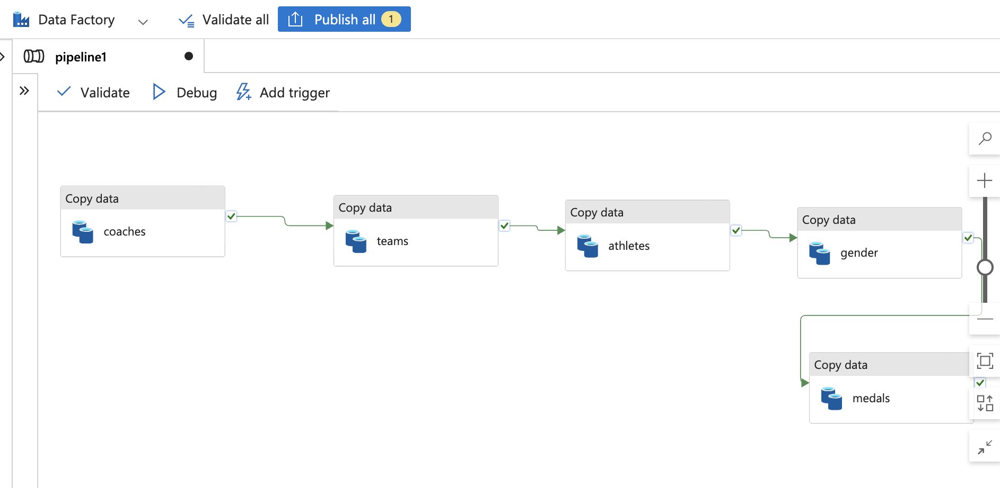
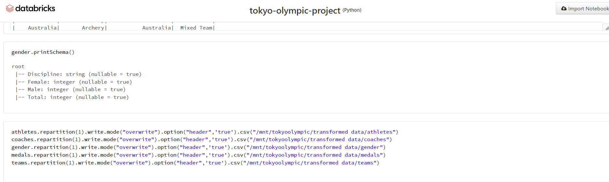
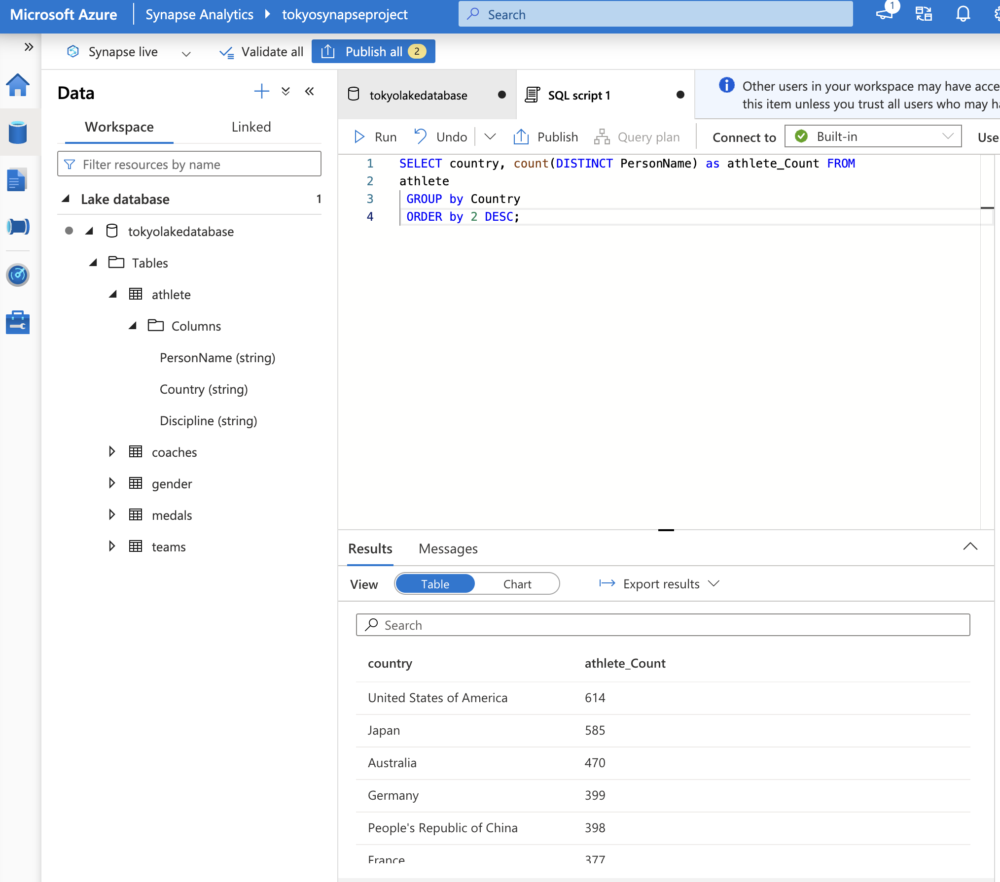
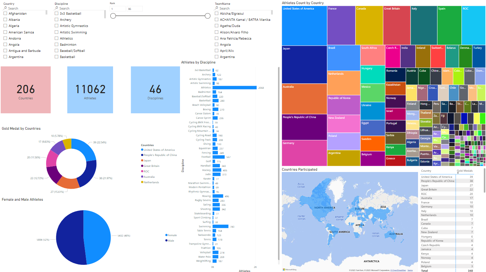

# Tokyo Olympics Data Analysis: Microsoft Azure End-to-End Pipeline 
This repository is a detailed guide on building and implementing an end-to-end data engineering pipeline for the analysis of Tokyo Olympics tournament data. This project leverages several Microsoft Azure services, including Azure Data Lake Gen2, Azure Data Factory (ADF), Azure Synapse Analytics, Databricks and Power BI.

## Table of Contents
- [Tokyo Olympics Data Analysis: Microsoft Azure End-to-End Pipeline](#tokyo-olympics-data-analysis-microsoft-azure-end-to-end-pipeline)
  - [Table of Contents](#table-of-contents)
  - [Project Overview](#project-overview)
  - [Project Architecture](#project-architecture)
  - [Technologies and Services Used](#technologies-and-services-used)
  - [Getting Started](#getting-started)
  - [Data Ingestion Process](#data-ingestion-process)
  - [Data Transformation Process](#data-transformation-process)
  - [Creation of Database using Azure Synapse](#creation-of-database-using-azure-synapse)
  - [Generating a report in PowerBI](#generating-a-report-in-powerbi)
  - [Conclusion](#conclusion)

## Project Overview
The goal of this project is develop an end-to-end pipeline to ingest, transform, analyze, and visualize historical data from the Tokyo Olympics. The data is first ingested into an Azure Data Lake Gen2 storage account using pipelines built in Azure Data Factory. The data is then transformed and cleaned using Databricks Notebooks. Azure Synapse Analytics is then used to create a SQL database with the cleaned data, which is subsequently loaded into PowerBI for advanced analytics and visualizations.

## Project Architecture
The architecture of this data pipeline has been designed to be robust and scalable. It consists of the following Azure services:

* Azure Databricks for data transformation.
* Azure Data Factory for data ingestion.
* Azure Storage (Data Lake Gen2) for data storage.
* Azure Synapse Analytics for creating a SQL database.
* Power BI for data visualization.

> 

## Technologies and Services Used
The project utilizes the following technologies and services from Microsoft Azure:

1. *Azure Databricks*: A Fast, easy, and collaborative Apache Spark–based analytics service.
2. *Azure Data Factory*: A fully managed, serverless data integration solution for ingesting, preparing, and transforming data.
3. *Azure Storage (Data Lake Gen2)*: A set of capabilities dedicated to big data analytics, built into Azure Blob storage.
4. *Azure Synapse Analytics*: An integrated analytics service for data integration, enterprise data warehousing, and big data analytics.
5. *Power BI*: A business analytics tool that delivers insights to enable fast, informed decisions.

> 

## Getting Started
To implement this project, ensure you have an active Azure subscription and have access to the services defined above and a Databricks Workspace.

## Data Ingestion Process
We employ ADF pipelines to ingest data into our Azure Data Lake Gen2 object storage. Our online data source is primarily raw files available under the data tab on GitHub.

> 

## Data Transformation Process
Once we successfully ingest data into the Data Lake, we use Azure Databricks notebooks where we mount our storage account and perform necessary data transformations.After we've transformed the data, we persist these files back into our Data Lake but this time in the `transformed_data` folder.

> 

## Creation of Database using Azure Synapse
We utilise Azure Synapse Analytics to create a database from our transformed data.

> 

## Generating a report in PowerBI
Finally, we will load this database into PowerBI and levarage the visualizations offered by the tool for an presenting pur analysis of the data

> 

## Conclusion
This project showcases an entire data pipeline built using prominent Microsoft Azure and Databricks services. The focus is to demonstrate an end-to-end process of ingesting raw data, performing transformations, and creating visualizations using PowerBI.

Throughout this entire journey, we gain insights from the Olympics data and present a high-level analytical overview. This pipeline can be used as a template for other similar large scale data engineering projects. Happy coding! 