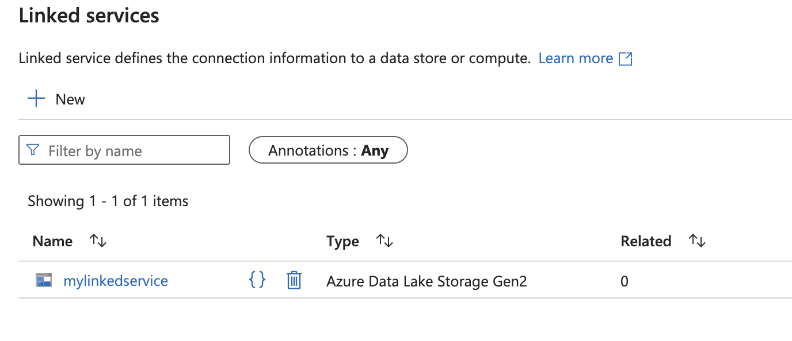
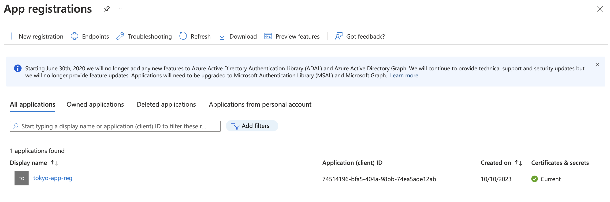
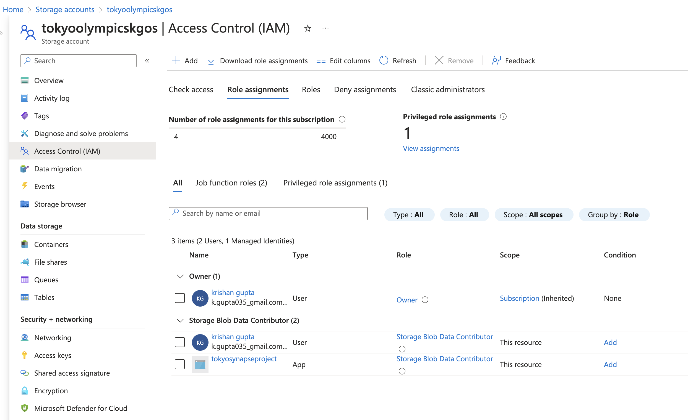
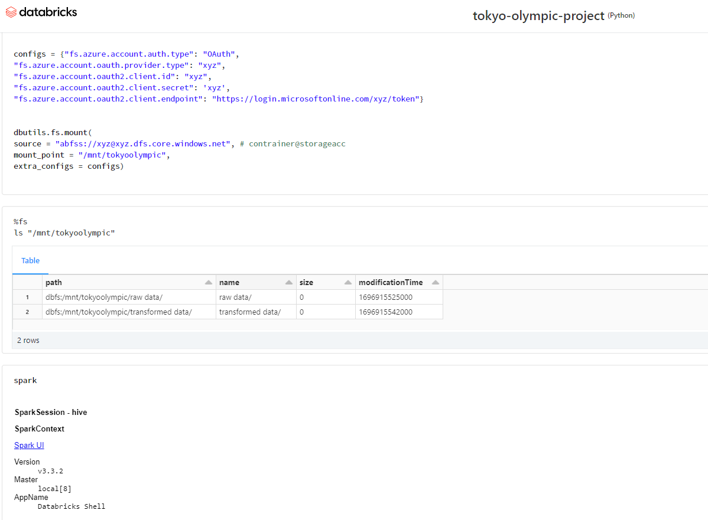

# Tokyo Olympics Data Analysis: Microsoft Azure End-to-End Pipeline Project 
This repository provides a comprehensive guide on how to build and implement an end-to-end data engineering pipeline for the analysis of Tokyo Olympics data. This project takes advantage of several Microsoft Azure services, including Azure Data Lake Gen2, Azure Data Factory (ADF), Azure Synapse Analytics, Databricks, and Power BI.

[Power BI Dashboard] (https://app.powerbi.com/view?r=eyJrIjoiNDlkOTVjYjEtYzM0Yi00OTc1LThhM2UtZTc2YmJlZjlhMzZkIiwidCI6ImNkMzE5NjcxLTUyZTctNGE2OC1hZmE5LWZjZjhmODlmMDllYSIsImMiOjN9)
[Databricks Notebook](https://databricks-prod-cloudfront.cloud.databricks.com/public/4027ec902e239c93eaaa8714f173bcfc/1379276969479999/3988380254920694/7589156471503808/latest.html) 

## Table of Contents
- [Tokyo Olympics Data Analysis: Microsoft Azure End-to-End Pipeline Project](#tokyo-olympics-data-analysis-microsoft-azure-end-to-end-pipeline-project)
  - [Table of Contents](#table-of-contents)
  - [Project Overview](#project-overview)
  - [Project Architecture](#project-architecture)
  - [Technologies and Services Used](#technologies-and-services-used)
  - [Getting Started](#getting-started)
  - [Data Ingestion Process](#data-ingestion-process)
  - [Data Transformation Process](#data-transformation-process)
      - [Creating the app:](#creating-the-app)
      - [Granting app access to the storage account:](#granting-app-access-to-the-storage-account)
  - [Creation of the Database using Azure Synapse Analytics](#creation-of-the-database-using-azure-synapse-analytics)
  - [Generating a report in PowerBI](#generating-a-report-in-powerbi)
  - [Conclusion](#conclusion)

## Project Overview
The goal of this project is to develop an end-to-end data pipeline to ingest, transform, analyze, and visualize historic data from the Tokyo Olympics. Initially, data is ingested into an Azure Data Lake Gen2 storage account using Azure Data Factory pipelines. Following ingestion, the data is processed and curated using Databricks Notebooks. Azure Synapse Analytics is then deployed to create a SQL database from the curated data, which is subsequently integrated into PowerBI for sophisticated analytics and visualizations.

## Project Architecture
The architecture of this data pipeline has been designed to be robust and scalable. It consists of the following Azure services:

* Azure Databricks for data transformation.
* Azure Data Factory for data ingestion.
* Azure Storage (Data Lake Gen2) for data storage.
* Azure Synapse Analytics for creating a SQL database.
* Power BI for data visualization.

## Technologies and Services Used
The project utilizes the following technologies and services from Microsoft Azure:

1. *Azure Databricks*: A Fast, easy, and collaborative Apache Spark–based analytics service.
2. *Azure Data Factory*: A fully managed, serverless data integration solution for ingesting, preparing, and transforming data.
3. *Azure Storage (Data Lake Gen2)*: A set of capabilities dedicated to big data analytics, built into Azure Blob storage.
4. *Azure Synapse Analytics*: An integrated analytics service for data integration, enterprise data warehousing, and big data analytics.
5. *Power BI*: A business analytics tool that delivers insights to enable fast, informed decisions.

## Getting Started
To implement this project, ensure you have an active Azure subscription and have access to the services defined above and a Databricks Workspace.

## Data Ingestion Process
We employ ADF pipelines to ingest data into our Azure Data Lake Gen2 object storage.To do this we would first have to create a LinkedService to connect AFD to our Storage Account.

Once we have established a connection we can create an Ingestion Pipeline on Azure Data Factory to pull the data from online sources and save it to our storage container.Our online data source is primarily raw files available under the data tab on GitHub.

## Data Transformation Process
After the successful ingestion of data into the Data Lake, we deploy Azure Databricks notebooks. These notebooks attach to our storage account and perform the necessary data transformations. This process involves creating an app under the App Registration Service and providing it with access control to the storage account.

#### Creating the app:

#### Granting app access to the storage account:

Once completed, we can connect and mount our storage container to the Databricks notebook. We then activate a Spark session to execute transformations. 

Following the execution of transformations, we store these files back into our Data Lake, but this time in the `transformed_data` folder.

## Creation of the Database using Azure Synapse Analytics
To create a database from our transformed data, we utilize Azure Synapse Analytics. 

## Generating a report in PowerBI
Finally, we will connect this database to PowerBI using Azure Connectors and levarage the visualizations offered by the tool for an presenting our analysis of the data

## Conclusion
This project showcases an entire data pipeline built using prominent Microsoft Azure and Databricks services. The focus is to demonstrate an end-to-end process of ingesting raw data, performing transformations, and creating visualizations using PowerBI.

Throughout this entire journey, we gain insights from the Olympics data and present a high-level analytical overview. This pipeline can be used as a template for other similar large scale data engineering projects. Happy coding! 